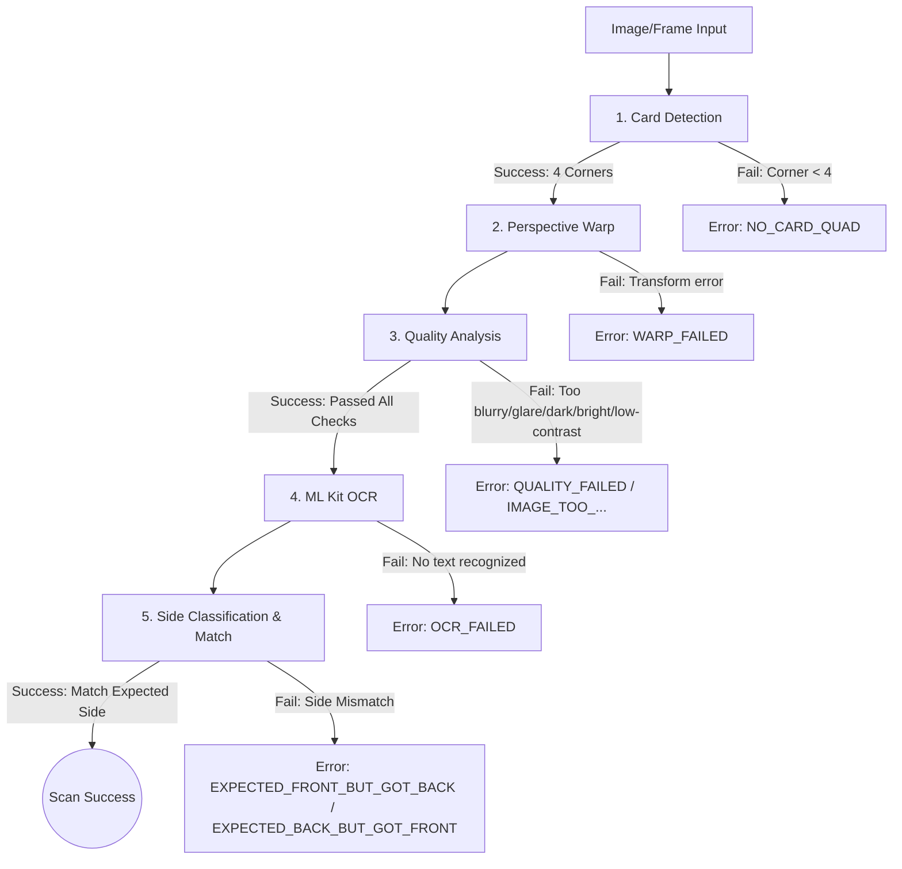

# Tài liệu Kỹ thuật Module CardScanner

## 2. Quy trình xử lý hình ảnh (Scanning Pipeline)

Quy trình xử lý ảnh đi qua 5 giai đoạn tuần tự dưới đây. Nếu bất kỳ giai đoạn nào không đạt điều kiện (validate failed), luồng quét sẽ dừng lại ngay lập tức và trả về mã lỗi tương ứng.

### Chi tiết 5 Giai đoạn:

### Giai đoạn 1: Phát hiện khung thẻ (Card Detection)
* **TFLite Detector:** Sử dụng mô hình SSD đầu vào dạng `uint8 RGB 512×512`. Mô hình dự đoán các hộp giới hạn cho 4 lớp (tương ứng 4 góc thẻ từ `0` đến `3`).
  * **Tiêu chí validate:** Phải phát hiện đầy đủ cả 4 góc thẻ (`bestBox.size == 4`). Nếu thiếu, hệ thống trả về lỗi `NO_CARD_QUAD`.
* **OpenCV Fallback:** Trường hợp TFLite gặp lỗi, OpenCV Canny Edge Detector + `findContours` được kích hoạt để dò tìm đa giác 4 cạnh.
  * **Tiêu chí validate:** Đa giác phải có diện tích tối thiểu chiếm **8%** khung hình (`minArea = frameArea * 0.08`).

### Giai đoạn 2: Cắt phối cảnh (Perspective Warp)
* Sử dụng thuật toán Homography (`getPerspectiveTransform` và `warpPerspective` của OpenCV) để chuyển đổi vùng thẻ nghiêng/méo trong ảnh nguồn thành một ảnh chữ nhật đứng thẳng, loại bỏ toàn bộ phần nền thừa xung quanh.

### Giai đoạn 3: Phân tích chất lượng ảnh (Quality Analysis)
Ảnh thẻ sau khi cắt được kiểm tra thông qua các thuật toán heuristic chính xác:

| Chỉ số kiểm tra | Thuật toán | Ngưỡng cấu hình mặc định | Lỗi trả về nếu vi phạm |
| :--- | :--- | :--- | :--- |
| **Độ mờ nhòe (Blur)** | Phương sai Laplacian trên ảnh xám | `blurVarianceMin = 80.0` | `IMAGE_TOO_BLURRY` |
| **Nhòe do chuyển động** | Tỷ lệ Sobel Gradient trục X và Y | Motion score > 0.82 kèm theo `blurVariance < 124.0` | `IMAGE_HAS_MOTION_BLUR` |
| **Độ phơi sáng tối** | Độ sáng trung bình (pixel mean) | `meanDark = 58.0` | `IMAGE_TOO_DARK` |
| **Độ phơi sáng sáng** | Độ sáng trung bình (pixel mean) | `meanBright = 198.0` | `IMAGE_TOO_BRIGHT` |
| **Độ tương phản** | Độ lệch chuẩn (StdDev) pixel ảnh xám | `contrastStdMin = 12.0` | `IMAGE_LOW_CONTRAST` |
| **Lóa sáng (Glare)** | Lọc vùng màu sắc HSV (V $\ge$ 250, S $\le$ 35) & Phân tích thành phần liên thông (Connected Component) | Đốm lóa liên thông chiếm $\ge$ 8.0% diện tích vùng ROI | `IMAGE_HAS_GLARE` |

### Giai đoạn 4: Nhận diện văn bản (OCR)
* Chuyển đổi ảnh thẻ OpenCV Mat thành Bitmap và chạy công cụ nhận diện ký tự **Google ML Kit Text Recognition**.
* **Tiêu chí validate:** Phải đọc ra tối thiểu một chuỗi văn bản không rỗng. Nếu không, trả về lỗi `OCR_FAILED`.

### Giai đoạn 5: Phân loại mặt thẻ & So khớp (Side Classification & Match)
Văn bản sau khi nhận diện sẽ được chuẩn hóa (loại bỏ dấu tiếng Việt, viết hoa toàn bộ) và chấm điểm từ khóa để phân biệt mặt trước hay mặt sau của thẻ CCCD.

* **Từ khóa mặt trước (Front Keywords):**
  > `"CAN CUOC"`, `"CAN CUOC CONG DAN"`, `"HO VA TEN"`, `"NGAY SINH"`, `"QUOC TICH"`, `"GIOI TINH"`, `"SO CC"`, `"SO CCCD"`, `"CCCD"`, `"CONG HOA XA HOI CHU NGHIA VIET NAM"`, `"DOC LAP TU DO HANH PHUC"`, `"SO DINH DANH CA NHAN"`, `"HO CHU DEM VA TEN KHAI SINH"`, `"NGAY THANG NAM SINH"`, `"CO GIA TRI DEN"`, `"IDENTITY CARD"`, `"CITIZEN IDENTITY CARD"`, `"QUE QUAN"`, `"NOI THUONG TRU"`.

* **Từ khóa mặt sau (Back Keywords):**
  > `"DAC DIEM NHAN DANG"`, `"NOI CU TRU"`, `"NGAY CAP"`, `"NOI DKKTT"`, `"IDVNM"`, `"BO CONG AN"`, `"MINISTRY OF PUBLIC SECURITY"`, `"NOI DANG KY KHAI SINH"`, `"PLACE OF BIRTH REGISTRATION"`, `"PLACE OF RESIDENCE"`, `"NGON TRO TRAI"`, `"NGON TRO PHAI"`, `"LEFT INDEX FINGER"`, `"RIGHT INDEX FINGER"`, `"CUC TRUONG CUC CANH SAT"`, `"PERSONAL IDENTIFICATION"`.

* **Tiêu chí phân loại:** 
  * So sánh điểm số từ khóa của hai mặt: `side = (frontScore > backScore) ? "front" : "back"`.
  * Nếu điểm bằng nhau hoặc cả hai đều bằng 0 $\rightarrow$ `unknown`.
* **Tiêu chí so khớp:** So sánh mặt thẻ nhận diện được (`actual`) với mặt thẻ kỳ vọng truyền từ JS (`expectedSide`). Nếu lệch nhau, trả về lỗi tương ứng:
  * `EXPECTED_FRONT_BUT_GOT_BACK`
  * `EXPECTED_BACK_BUT_GOT_FRONT`

---

## 3. Các cấu hình tối ưu hóa thời gian thực (Live-Scan Optimization)

Trong chế độ live preview (frame processor), module áp dụng cơ chế tối ưu hóa tài nguyên (CPU/GPU) để đảm bảo FPS ổn định:

* **OCR Cooldown & Cache (`ocrCooldownMs = 500ms`, `ocrReuseMaxAgeMs = 30000ms`):** Tránh thực hiện OCR liên tục trên mọi frame. Nếu vị trí 4 góc thẻ ổn định (độ dịch chuyển góc `maxCornerDriftRatio < 10%`), hệ thống sẽ tái sử dụng kết quả OCR cũ trong vòng tối đa 30 giây.
* **Detect Throttle (`detectThrottleFramesWhenStable = 5`):** Khi hệ thống đã xác định được thẻ ổn định và kết quả OCR hợp lệ, tần suất gọi mô hình TFLite định vị góc sẽ được giãn cách ra (chỉ chạy 1 lần mỗi 5 frame) nhằm giảm nhiệt độ thiết bị và tăng thời lượng pin.
* **Stale Async Drop (`ocrStaleMaxFrameGap = 8`):** Nếu tiến trình chạy OCR bất đồng bộ trả kết quả về trễ quá 8 frame so với frame camera hiện tại, kết quả đó sẽ bị hủy bỏ (drop) để tránh lệch dữ liệu.
