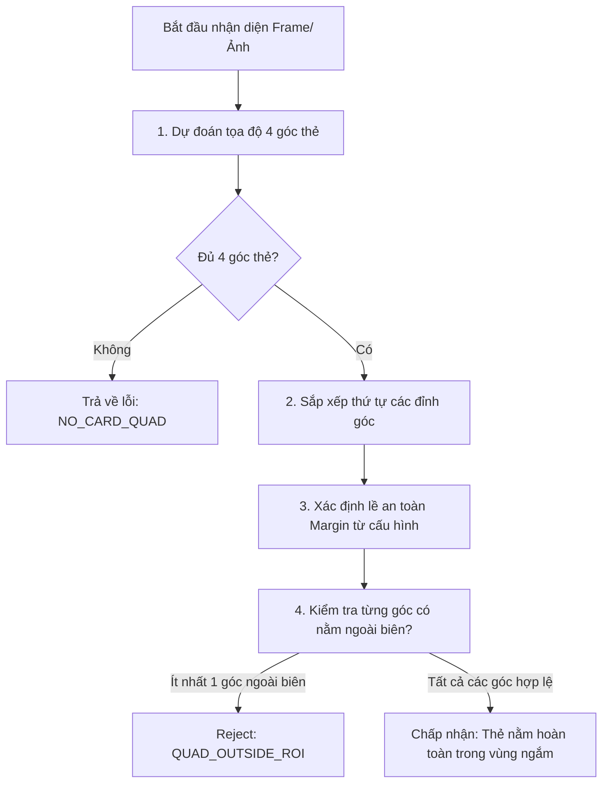

# Quy trình kiểm tra 4 góc thẻ CCCD trong vùng ngắm (ROI)

Tài liệu này mô tả chi tiết cách module [CardScanner](file:///d:/SourceCode/myf88-mobile-workspace/apps/myF88/node_modules/react-native-ekyc-sdk/android/src/main/java/com/cardscanner/CardScannerModule.kt) thực hiện kiểm tra 4 góc của thẻ CCCD nhằm đảm bảo thẻ nằm trọn vẹn trong vùng ngắm (Region of Interest - ROI), tránh tình trạng thẻ bị chụp mất góc hoặc bị cắt xén một phần.

---

## Sơ đồ thuật toán kiểm tra góc (ROI Validation Flow)



---

## Chi tiết các bước thực hiện

### Bước 1: Phát hiện tọa độ 4 góc thẻ
Quá trình này được xử lý chính bằng mô hình học máy TensorFlow Lite trong [TfLiteCardDetector.kt](file:///d:/SourceCode/myf88-mobile-workspace/apps/myF88/node_modules/react-native-ekyc-sdk/android/src/main/java/com/cardscanner/scanner/TfLiteCardDetector.kt):
1. Mô hình SSD nhận đầu vào kích thước `512x512 RGB` để dự đoán hộp giới hạn (Bounding Box) của 4 góc thẻ CCCD tương ứng với các phân lớp từ `0` đến `3`.
2. Hệ thống tìm kiếm các góc có điểm số tin cậy (Confidence Score) cao nhất cho từng lớp.
3. **Điều kiện quyết định:** Nếu số lượng góc phát hiện được nhỏ hơn 4 (`bestBox.size < 4`), hệ thống lập tức từ chối và trả về mã lỗi `NO_CARD_QUAD` (Không tìm thấy đầy đủ 4 góc giấy tờ).

---

### Bước 2: Sắp xếp thứ tự các điểm góc
Sau khi lấy được 4 điểm góc, hệ thống thực hiện sắp xếp thứ tự tọa độ để đồng nhất điểm đỉnh (Vertex) theo chiều kim đồng hồ thông qua [CardQuadOrdering.kt](file:///d:/SourceCode/myf88-mobile-workspace/apps/myF88/node_modules/react-native-ekyc-sdk/android/src/main/java/com/cardscanner/scanner/CardQuadOrdering.kt):
* **Thứ tự sắp xếp:** Top-Left (Trên-Trái), Top-Right (Trên-Phải), Bottom-Right (Dưới-Phải), Bottom-Left (Dưới-Trái).
* Điều này giúp quá trình cắt phối cảnh (Perspective Warp) ở giai đoạn tiếp theo diễn ra chuẩn xác, không bị lật ngược hoặc xoay méo ảnh thẻ.

---

### Bước 3: Xác định biên lề an toàn (Margins)
Hệ thống sử dụng tỷ lệ biên an toàn được cấu hình trong [CardScannerPipelineConfig.kt](file:///d:/SourceCode/myf88-mobile-workspace/apps/myF88/node_modules/react-native-ekyc-sdk/android/src/main/java/com/cardscanner/scanner/CardScannerPipelineConfig.kt):
* Tham số định cấu hình: `quadBorderMarginFraction = 0.02` (mặc định là **2%** kích thước khung hình).
* **Công thức tính toán khoảng cách biên tối thiểu:**
  $$\text{mx} = \text{detW} \times \text{quadBorderMarginFraction}$$
  $$\text{my} = \text{detH} \times \text{quadBorderMarginFraction}$$
* **Công thức xác định vùng biên giới hạn hợp lệ:**
  $$\text{Trục X hợp lệ: } [mx, \text{detW} - mx]$$
  $$\text{Trục Y hợp lệ: } [my, \text{detH} - my]$$

---

### Bước 4: Kiểm tra sự hiện diện của 4 góc trong vùng ngắm (ROI)
Hàm [`quadInsideDetectRoi`](file:///d:/SourceCode/myf88-mobile-workspace/apps/myF88/node_modules/react-native-ekyc-sdk/android/src/main/java/com/cardscanner/scanner/CardScannerLiveDetectScheduler.kt#L287-L302) trong class [CardScannerLiveDetectScheduler.kt](file:///d:/SourceCode/myf88-mobile-workspace/apps/myF88/node_modules/react-native-ekyc-sdk/android/src/main/java/com/cardscanner/scanner/CardScannerLiveDetectScheduler.kt) sẽ duyệt qua cả 4 điểm để kiểm tra:

```kotlin
fun quadInsideDetectRoi(
  points: List<CvPoint>,
  detW: Int,
  detH: Int,
  marginFraction: Double,
): Boolean {
  if (detW <= 0 || detH <= 0) return false
  val mx = detW * marginFraction
  val my = detH * marginFraction
  val maxX = detW - mx
  val maxY = detH - my
  return points.all { p ->
    p.x >= mx && p.x <= maxX && p.y >= my && p.y <= maxY
  }
}
```

* **Quy tắc quyết định:**
  * Nếu **toàn bộ 4 điểm góc** của đa giác đều thỏa mãn nằm trong biên giới hạn ($x \in [mx, maxX]$ và $y \in [my, maxY]$), hàm trả về `true`. Thẻ được coi là **đã nằm trọn vẹn trong vùng ngắm**.
  * Nếu có **ít nhất 1 điểm góc** rơi vào khoảng lề biên hoặc nằm ngoài khung hình camera, hàm trả về `false`.
  * Khi hàm trả về `false`, bộ lập lịch scheduler sẽ từ chối tái sử dụng góc thẻ (`QUAD_OUTSIDE_ROI`), yêu cầu người dùng điều chỉnh thiết bị để căn chỉnh lại thẻ cho đúng vùng ngắm camera.
